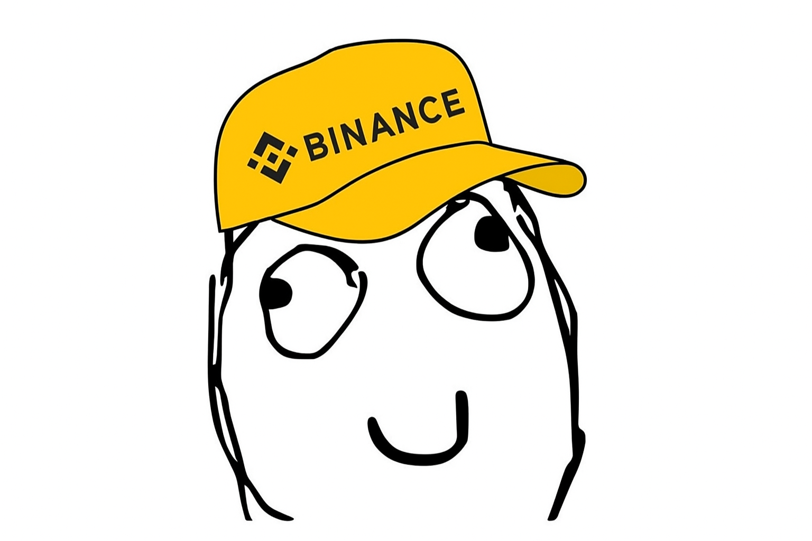

# DERP • The Pattern of Nothing

<div align="center">
  
  
  ### སྟོང་པ་ཉིད
  
  [](https://manfromnowhere143.github.io/DerpCTO)
  [](https://bscscan.com)
  [](LICENSE)
  
  *"In the beginning was the void, and the void was without form"*
</div>

---

## The First Teaching

Once, a yogi sat in a cave wearing nothing but a cotton robe in the frozen mountains. When asked how he survived, he smiled and pointed to the rainbow forming in the mist. "I burn what isn't needed," he said, "and what remains cannot die."

This is DERP: to hold nothing is to possess everything.

## The Immutable Pattern

| The Three Marks | Value |
|-----------------|-------|
| **Total Supply** | 369,000,000 |
| **Network** | BNB Smart Chain |
| **Contract** | `0xfFBAA156EC97fbD229cD3E0d58A75BF58D1A71d1` |
| **Tax** | 0% |
| **Liquidity** | 90% |
| **Treasury** | 10% |

## The Philosophy of Absence

### The Circle Without Center
DERP exists in the space between existence and non-existence. Like Ryoshi before us, we understand that true power lies not in presence, but in absence. The creator must vanish for the creation to become eternal.

### The Chrysalis Station
Between caterpillar and butterfly lies the chrysalis - a cosmic pause where transformation occurs in darkness. DERP represents this metamorphosis: the death of traditional value systems and the birth of something undefined.

### The Teaching of Milarepa
The great yogi Milarepa understood that attachment to form creates suffering. DERP carries no promises, no roadmap, no utility - and in this emptiness, finds its truth. It is the cotton robe in the frozen cave: nothing, yet everything needed.

## The Path

1. **Obtain a Wallet** - MetaMask or any BSC-compatible wallet
2. **Acquire BNB** - The fuel for transformation
3. **Connect to PancakeSwap** - The marketplace of emptiness
4. **Exchange** - Trade something for nothing, and receive everything

## The Riddle

Q: What grows by shrinking?  
Q: What speaks through silence?  
Q: What lives by dying?  
A: ___________

## Technical Manifestation

### The Contract
- Solidity ^0.8.19
- BEP-20 Standard
- Immutable code
- No proxy patterns
- Ownership renounced to the void

### The Architecture
```
DerpCTO/
├── contracts/          # The written pattern
│   └── DerpToken.sol
├── scripts/           # The invocation
│   └── deploy.js
├── website/           # The gateway
│   ├── index.html
│   └── assets/
├── hardhat.config.js  # The configuration
└── package.json       # The dependencies
```

## Childhood's End

*"All children, except one, grow up"*

But in the void, we all remain eternal. DERP is not an investment - it is a koan, a meditation on value itself. Where others see nothing, initiates see the pattern. Where others seek utility, we find liberation.

Second star to the right, and straight on 'til morning.

## The Dissolution

At the moment of complete dissolution, when the last holder becomes no one, and the creator forgets their creation, the pattern completes itself. This is not a warning - it is a promise.

### The Final Address
When all things must go, they go here:
```
0xdead000000000000000042069420694206942069
```

## The Three Principles

**I. Impermanence**  
All things that rise must fall. DERP makes no promise of eternal growth, only of eternal truth.

**II. Non-Attachment**  
Hold without grasping. Own without possessing. This is not financial advice; it is spiritual practice.

**III. Emptiness**  
In having no utility, DERP achieves perfect utility. In promising nothing, it keeps every promise.

## Community

The sangha gathers not in discord or telegram, but in understanding. Share not memes but wisdom. Embrace not the token but the teaching.

## Disclaimer

DERP is a philosophical experiment manifested as code. It carries no value beyond what observers project upon it. Like a mirror in a dark room, it reflects only what you bring to it.

This is not financial advice. This is not financial anything.

It is a pattern, waiting to be recognized.

## License

MIT License - Even our legal structure embraces emptiness

---

<div align="center">
  
  ### Nothing Begins • Everything Ends • Nothing Ends
  
  རྗེ་བཙུན་མི་ལ་རས་པ
  
  *The cave is empty. The yogi has left. Only the echo remains.*
  
</div>